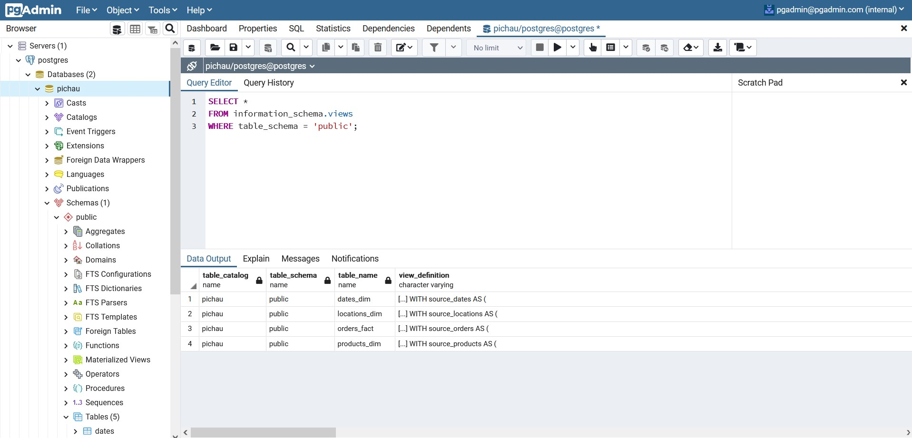
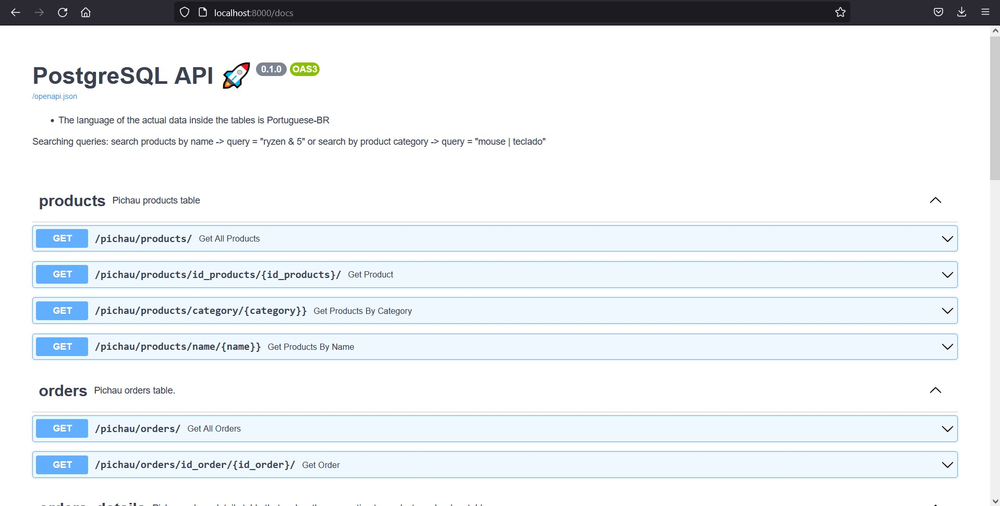
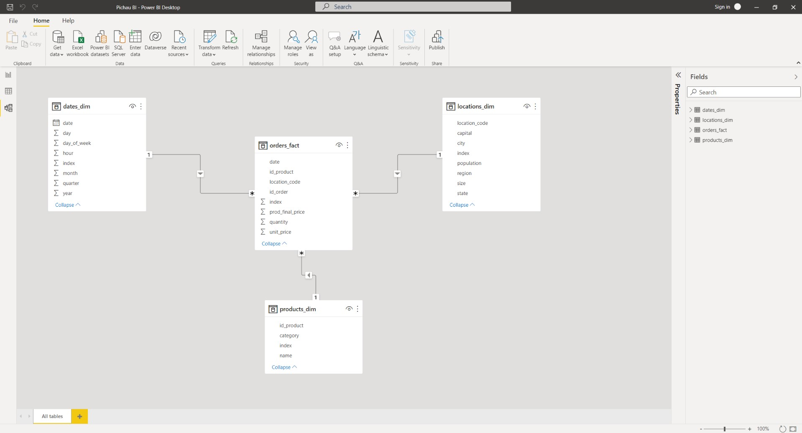

# Analytics Engineering (Web scraping, PostgreSQL, DBT, FastAPI, Power BI)

### - Scrapes products data from brazilian PC webstore -> pichau.com.br

### - Generates orders data and inserts tables in a PostgreSQL db

### - Connects to PGAdmin GUI

### - Uses DBT to transform and load data into dimensions and fact tables (star schema)

### - Create an API (FastAPI)

### - ALL wrapped in a docker compose.

-> Check/change docker-compose.yaml file if you want to change PostgreSQL and PGAdmin credentials. The server host name is the name of the PostgreSQL service inside the docker-compose file. Inside the "screenshots" folder there are references on how to connect to server in PGAdmin.

### - just run "docker-compose up -d" in your terminal (inside this folder) -> access PGAdmin in "localhost:5050" and API in "localhost:8000/docs/"

### You can connect Power BI to both the database directly or to the API (the file already connects to the API for demonstration purposes). 
