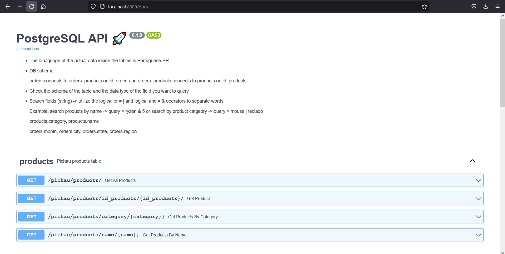
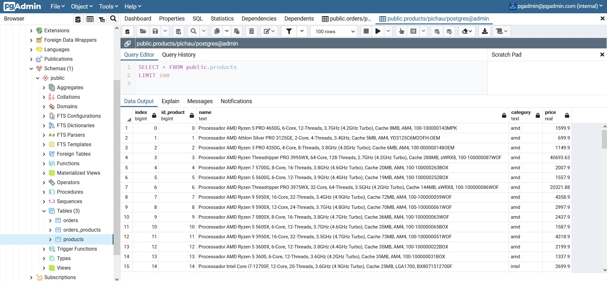

# Web_scraping_PostgreSQL_API

### - Scrapes products data from brazilian PC webstore -> pichau.com.br

### - Generates orders data and inserts tables in a PostgreSQL db

### - Connects to PGAdmin GUI

### - Create an API (FastAPI)

### - ALL wrapped in a docker compose.

-> Check/change docker-compose.yaml file if you want to change PostgreSQL and PGAdmin credentials. The server host name is the name of the PostgreSQL service inside the docker-compose file. Inside the "screenshots" folder there are references on how to connect to server in PGAdmin.

PS. In order for the pichau_scraping.py script to run and generate the orders data, **you need to download the brazilian cities excel file** at http://blog.mds.gov.br/redesuas/wp-content/uploads/2018/06/Lista-de-Munic%C3%ADpios-com-IBGE-Brasil.xlsx, clean it (remove procv functions), rename it to cities_brazil.xlsx and **put it inside the "api" folder**. You can check the notebook to see how the excel/dataframe is structured as well.

### - just run "docker-compose up -d" in your terminal (inside this folder) -> access PGAdmin in "localhost:5050" and API in "localhost:8000/docs/" 
